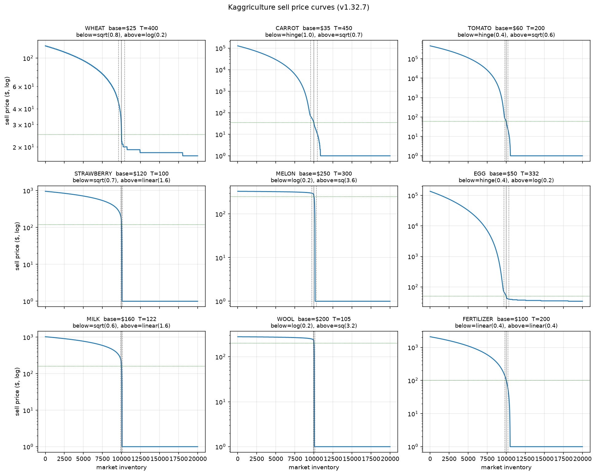
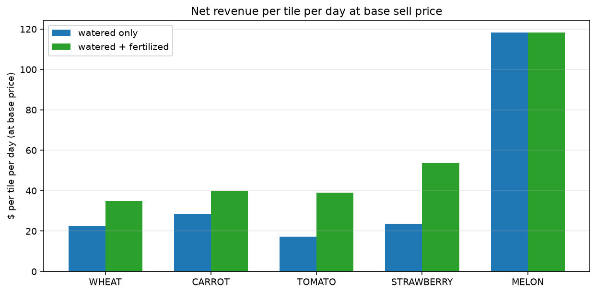
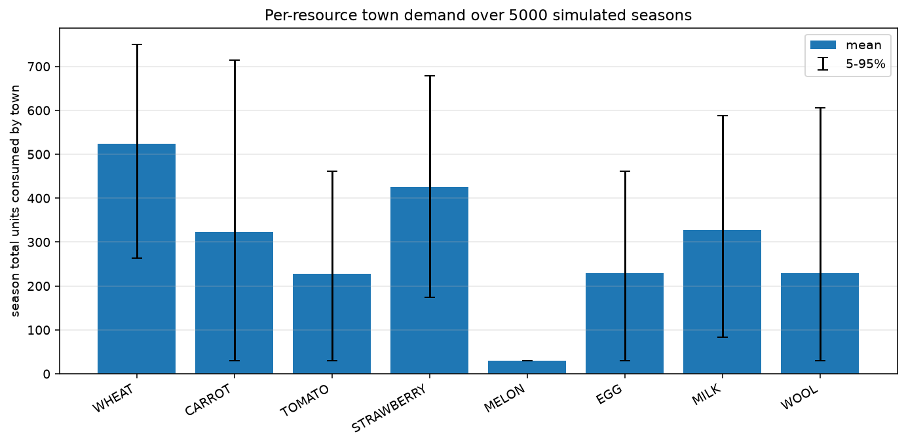
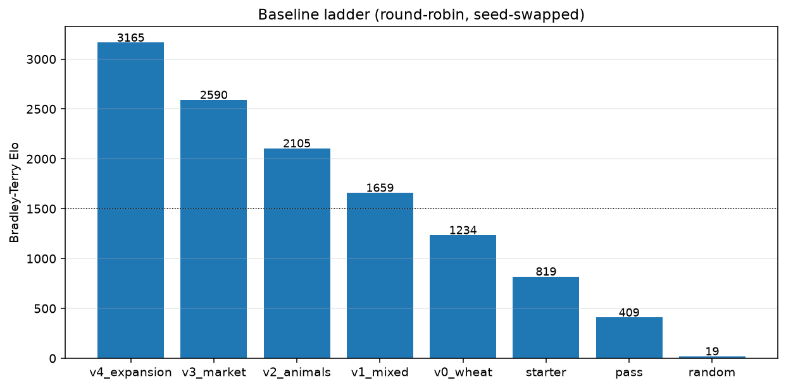
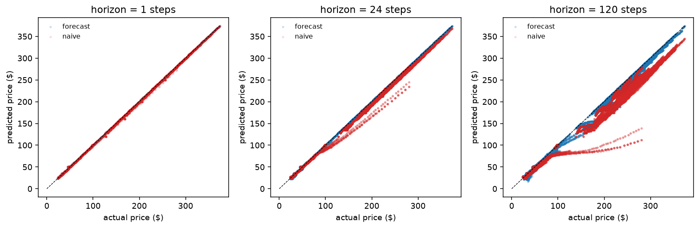

# kaggriculture

[](https://github.com/OscarLegoupil/agriculture-agent/actions/workflows/ci.yml)

Autonomous-agent work on the [Kaggriculture](https://www.kaggle.com/competitions/kaggriculture) Kaggle simulation. Two players compete on separate farms across a 30-day, 720-turn season on a dynamic market. This is a working project, not a submission notebook: reproducible workflow from environment analysis to a competitive agent.

## Progress

- [x] **M1** foundations, CI, deps, smoke test
- [x] **M2** typed env wrappers, action legality checker, 5 dynamics notebooks
- [x] **M3** evaluation harness: parallel runner, replay logger, per-episode metrics, Bradley-Terry rating, A/B compare CLI, MLflow tracking
- [x] **M4** rule-based baselines: five hand-crafted agents (v0-v4), each closed with a two-agent A/B, plus a round-robin Elo report
- [x] **M5** economic planning core: per-crop and per-animal ROI tables, wheat feed budgeter, static tile allocator, dynamic re-planner
- [x] **M6** market and opponent modeling: price forecaster ([model card](reports/market-forecaster-card.md)) and opponent inventory tracker
- [x] **M7** advanced planner: route + micro-controller + public-state selector, tuned by offline beam search
- [ ] **M8** submission, hardening, final writeup

## The environment at a glance



Sell prices react to inventory shifts with different shapes on each side of the equilibrium `I0`. Premium goods (strawberry, melon, milk, wool) crash to the $1 floor on modest gluts. Carrot, tomato, and egg use a `hinge` shape that spikes sharply past a threshold on scarcity. Wheat is the only near-linear resource, and the only staple.

<table>
<tr>
<td width="50%">



Melon leads `$/tile/day` at base prices, but is glut-crash prone. Strawberry gains the most from fertilizer.

</td>
<td width="50%">



Wheat and strawberry are the most reliably-demanded. Melon has near-zero shop demand. Wool distribution is bimodal because yarn stores may never spawn.

</td>
</tr>
</table>

Details in [`notebooks/`](notebooks/): market curves, crop yields, animal economics, town demand, hire ROI.

## Evaluating agents

The eval harness runs pairings in parallel with deterministic seeds and seat swapping, and reports Bradley-Terry Elo, Wilson CIs, and a sign-test p-value.

```bash
uv run kagg-compare pass starter --n 50 --config '{"episodeSteps": 720}'
```

```
=== kagg-compare: pass vs starter ===
episodes: 100  duration: 32.1s  (0.32s/ep)

pass                  W:    0  L:  100  T:   0   win_rate: 0.0%   [95% CI: 0.0%-3.7%]
starter               W:  100  L:    0  T:   0   win_rate: 100.0% [95% CI: 96.3%-100.0%]

sign test (two-sided): p = 1.58e-30
Bradley-Terry Elo (mean 1500):  starter 2100  pass 900  delta +1200
```

Add `--replay-dir data/raw/replays` to save every episode's JSON and a `manifest.jsonl` for downstream analysis. Add `--mlflow` to log to a local MLflow store.

## Baseline ladder

Each baseline exercises one strategic axis and closes its commit with an A/B against its predecessor. A round-robin over all baselines plus the three built-in agents produces the internal Elo ladder:



- **v0** pure wheat loop, single tile.
- **v1** wheat + carrot on two adjacent tiles.
- **v2** adds one fed and cared goose (coop at (4, 3)), delayed until the wheat pipeline is producing to avoid ramp-up starvation.
- **v3** market-responsive selling and fertilizer reuse. Fertilizer from the goose is applied at the start of each plant's bonus window, lifting wheat cap 4 -> 6 and carrot 3 -> 4.
- **v4** adds a second carrot tile at (3, 3) and one hired hand ($1). Land expansion is available but not automatically triggered at this scale.

Full report and win-rate matrix under [`reports/baselines-elo.md`](reports/baselines-elo.md).

## Economic planning core

M5 turns the dynamics notebooks into a small operations-research layer under `src/kaggriculture/planning/`:

- `crop_roi(crop, watered, fertilized, price)` returns lifecycle units, days to peak, and coins per tile per day. Fertilizer cost is a caller-supplied parameter so animal-produced (free) and market-bought ($100) regimes stay explicit.
- `animal_roi(animal, cared, product_price, feed_cost_per_day)` returns steady-state coins per day and an exact discrete break-even day, computed from a cumulative-net trace rather than the loose continuous formula in the notebook.
- `feed_budget(roster)` projects daily wheat consumption from an `AnimalPlan` list and derives the wheat tile count required to sustain the peak.
- `allocate(tiles, horizon_days, price_map)` enumerates every feasible animal roster and picks the (roster + wheat reserve + best fill crop) combination that maximises expected coins over the remaining horizon.
- `DynamicReplanner` wraps the allocator with a state machine that re-plans when observed prices drift more than `threshold_pct` from the working forecast, and exposes a `replan_frequency` counter for the harness.

The v5+ agents will consume these tables rather than hard-coding tile choices.

## Market and opponent modeling

M6 adds two online modules used by the planner and by the M7 trading layer:

- `src/kaggriculture/market/` ships a `PriceForecaster` that combines the deterministic price curve, the deterministic town consumption schedule, and an EWMA net-trade-rate estimate. Predicted prices plug straight into `DynamicReplanner`'s `price_map`. Aggregate MAE against a five-pairing pool: $0.05 at 1 step, $1.88 at 1 day, $19.3 at 5 days, versus $0.78 / $17.6 / $84.3 for the naive constant-price baseline. Full protocol and per-commodity breakdown in the [model card](reports/market-forecaster-card.md).
- `src/kaggriculture/opponent/` ships an `OpponentInventoryTracker` that reconstructs the opponent's hidden shed from the market inventory ledger (dzjiann's bookkeeping identifier, discussion 737027). Measured MAE across the same opponent pool is exactly zero for every commodity, matching the strong identifiability claim. When a commodity's price sits at the floor the tracker widens the uncertainty interval by the maximum orders the opponent could hide.



## Advanced planner

M7 layers a portfolio of route configs under `configs/routes/`, a public-state selector, and an offline beam search under `src/kaggriculture/search/`:

- A route is a YAML plan for one 720-turn episode: tile assignments, coop / pasture placement, hire schedule, land buys, market policy, and an optional embedded micro block. `RouteAgent` in `src/kaggriculture/agent/route_agent/` turns any parsed route into a Kaggle-callable `agent(obs)` and reproduces v4_expansion byte-for-byte on fixed seeds.
- `MicroController` overlays M6 forecast and opponent-tracker signals on the route's market policy each turn. Rules are additive-only: hard-drop, forecast-salvage, and tail-salvage. In a paired 400-game A/B this overlay beats plain v4 396-4 at defaults, and 386-14 with tuned parameters (sign test p ~= 2e-95, Elo delta +576).
- `RouteSelector` picks one of four v4 variants after day 3 from opponent tile and land signals. The picked route + a tuned micro layer beats the v4+micro baseline 378-22 on 400 games (Elo delta +494).
- `kaggriculture.search.beam` is a small discrete-grid beam search that tunes route and micro parameters against a target opponent family. It converges on the same configuration the M7-c heuristic picks for the v4+micro family, and the beam-searched YAML at `configs/routes/tuned/v4_micro.yaml` beats plain v4+micro 189-11 on 200 games (Elo delta +494).

## Current submission

`submissions/20260902-v5/main.py` (agent v5) is the packaged output of M7. It bundles the route decision tree, micro tail-salvage rule, and public-state selector as a single self-contained file with no imports of the `kaggriculture` package.

Runtime posture: 800 ms per-turn hard budget with a safe `PASS` fallback on overrun; per-episode state resets when the observation step index moves backwards, so re-used worker processes cannot leak state. Local smoke test against `starter` on seed 42 finishes at 9604 coins.

## Quickstart

Python 3.11 to 3.12, [uv](https://docs.astral.sh/uv/).

```bash
git clone https://github.com/OscarLegoupil/agriculture-agent.git
cd agriculture-agent
uv sync --extra dev --extra notebooks
uv run pytest
make sim   # runs a full 720-turn episode locally
```

## Repository layout

```
src/kaggriculture/env/       typed observation wrappers, action builders, legality checker
src/kaggriculture/planning/  ROI tables, feed budget, tile allocator, dynamic re-planner
src/kaggriculture/market/    price curve and online forecaster
src/kaggriculture/opponent/  inventory inference from public state
src/kaggriculture/agent/     shipped agent and its route + micro-controller layers
src/kaggriculture/search/    offline beam search over route + micro parameters
configs/routes/              route YAMLs (baseline, three v4 variants, tuned/ cache)
submissions/                 dated Kaggle submission bundles (self-contained main.py)
notebooks/                   numbered dynamics analysis notebooks
reports/figures/             committed figures produced by notebooks
tests/                       pytest suite
configs/                     experiment configs (YAML, populated as milestones land)
data/                        generated replays and metrics (gitignored, DVC-tracked)
```

## License

MIT. See [LICENSE](LICENSE).
