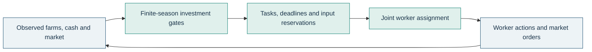

# Kaggriculture

**65.2% weighted holdout match score against two independent public agents**, with a 95% paired-seed interval of **60.0–70.5%**. The policy combines finite-season investment decisions with bounded joint worker assignment. These are local simulator results, not a live leaderboard rating.


*v7 on the left, pinned lonespear on the right. Seed 0, day 21. Rendered from an actual replay with the official environment; [frame provenance](reports/figures/gameplay.json).*

## The problem

[Kaggriculture](https://www.kaggle.com/competitions/kaggriculture) is a two-player farming simulation. Each player starts with 3,000 coins and 25 usable tiles on a 10 × 10 farm. Crops take time to mature, animals need feed and care, and daily worker costs follow a Fibonacci sequence. Both farms sell into the same market: profitable production can destroy its own selling price.

Only final cash counts. A valuable crop that cannot be harvested, carried home and sold in time is worth nothing. The optimization problem couples **investment, scheduling, working capital and market exposure**.

## The solution



The deployed policy lives in [one self-contained module](src/kaggriculture/agent/competitive.py). It rebuilds decisions from observations, preserving actual asset ages, inventories and cash without hidden episode state.

**Finite-season investment.** New crops receive no revenue before maturity. All five commercial crops compete for planting slots. Animal purchases account for remaining production events, feed expense and market exposure. Cash reserves constrain purchases; future shop demand uses expected draws, never future realized state.

**Coordinated execution.** Minimum-cost assignment matches workers to distinct destinations using task value, urgency, travel and pickup costs. Seeds, stored inputs and delivery capacity are reserved. The solver prepares a valid greedy fallback and checks a 150 ms budget during execution. Transition instrumentation exposes invalid actions and resource losses.

**Measured production choices.** Official-interpreter screens explored land, labor, crop-only and livestock-only policies, animal mixes, fertilizer, grown feed, openings and delivery thresholds. Selected capacity bounds are two quadrants, 11 hired workers, up to 30 crops and a herd of four cows, six sheep and eight geese. These are ceilings; observed state and economic gates determine purchases.

**Cash at the finish.** The last action is day 29, hour 22. There is no final nightly inventory drop. Return trips and sales must fit the remaining action opportunities.

## Evidence

The primary score weights lonespear and GzmCR equally. TinaawhyteD provides an independently implemented crop-only check with no primary weight. Mirrors and supply-heavy variants are diagnostics, not additional independent opponents.


| Holdout opponent | Pinned revision | Wins / games | Mean v7 cash | Mean opponent cash |
|---|---|---:|---:|---:|
| [lonespear, livestock-led mixed](https://github.com/lonespear/kaggriculture/tree/774b26093ccf4246525517d48420349b841b6e50) | `774b260` | 155 / 256 | 87,779 | 81,377 |
| [GzmCR, mixed farming](https://github.com/GzmCR/Kaggriculture/tree/6a76335397d5cd2facffa91c938f629b119ea350) | `6a76335` | 179 / 256 | 84,560 | 79,581 |
| [TinaawhyteD, crop-only](https://github.com/TinaawhyteD/kaggriculture-agent/tree/169ca945b3358cd85baa71260e9c17dc0ebe5555) | `169ca94` | 256 / 256 | 108,239 | 19,033 |

Development used 16 seeds and validation used 64. The frozen artifact then played the 128-seed holdout once: 768 games, including both seats against all three opponents. Confidence intervals resample complete seeds, retaining both seats and both primary opponents together. Draws count as half a win. The predeclared promotion gate passed: lower 95% bound above 50%, no candidate errors and no independent strategy family below 40%. [Protocol and experiment record](reports/competitive-evaluation.md) · [holdout summary](reports/results/holdout-summary.json) · [validation summary](reports/results/validation-final-summary.json) · [compressed evidence index](reports/results/index.json).

### What changed from v5

The original four-tile v5 beat starter but lost against every independent reference in the diagnostic panel. It remains unchanged. The same four development seeds show both improvement and a difficult matchup:

| Opponent | v5 wins | v7 wins | v5 mean cash | v7 mean cash |
|---|---:|---:|---:|---:|
| Starter | 8 / 8 | 8 / 8 | 9,121 | 112,552 |
| lonespear | 0 / 8 | 8 / 8 | 8,653 | 78,667 |
| GzmCR | 0 / 8 | 2 / 8 | 8,326 | 93,333 |
| TinaawhyteD | 0 / 8 | 8 / 8 | 9,338 | 108,302 |

*Seeds 0, 17, 42 and 103, both seats. This small development panel is not the promotion test. Source versions, executable hashes and effective configuration are saved with the results.*


The important gain was executable production. The old static allocator also credited immature crops with average daily income and excluded commercial wheat. Those assumptions are corrected and tested against the interpreter. Earlier phased planning and route controllers remain available for historical comparison; v7 does not deploy them.

### An ablation that changed the design


Joint assignment reduced mean travel from 4,250 to 3,841 moves and increased successful work from 2,377 to 2,597 actions. Match score rose from 37.5% to 75% across eight games per candidate. This small paired development panel justified broader testing; it is not the headline strength estimate.

More land, more workers and larger herds did not consistently pay. Strawberry-heavy expansion, early goose-first openings and harvest batching also lost their screens. A pickup/drop loop and a same-turn reservation bug were execution defects, not evidence against livestock. Fixes have dedicated regressions.

## Reproduce it

Python 3.11 or 3.12 and [uv](https://docs.astral.sh/uv/) are required. The lockfile pins `kaggle-environments==1.32.7`.

```bash
uv sync --frozen --extra dev
uv run pytest tests/test_competitive_smoke.py -q
```

The second command is the one-command smoke evaluation: the frozen artifact plays starter in both seats. `make smoke` runs the same check where Make is available.

Fetch the reviewed references and run a paired benchmark:

```bash
uv run python scripts/fetch_references.py
uv run python scripts/benchmark.py --candidate submissions/20260909-v7/main.py --opponents data/raw/reference-lonespear/main.py data/raw/reference-gzm/main.py --seeds 0 17 42 103 --output data/interim/reproduction.json
uv run python scripts/summarize_benchmark.py data/interim/reproduction.json
```

Search production choices, verify packaging and regenerate figures:

```bash
uv run python scripts/search_production.py --stage 1 --output data/interim/production-search.json
uv run python scripts/package_submission.py
uv run python scripts/verify_submission.py --output data/interim/packaging-check.json
uv run python scripts/figures.py --evaluation reports/results/holdout-v7.json
uv run python scripts/diagnose_benchmark.py reports/results/holdout-v7.json --output data/interim/diagnostics.json
uv run python scripts/render_replay.py --screenshot
```

The screenshot command needs Chrome or Chromium (`--chrome PATH` selects it). It also exports an interactive official HTML replay into ignored `reports/replays/`. Compressed results are read transparently. Restore an exact historical executable with `scripts/restore_candidate.py SHA256`, using its manifest's digest.

## Reliability and boundaries

The [standalone artifact](submissions/20260909-v7/main.py) is built deterministically from the deployed source. SHA-256:

```text
750f123073865347efd3b9c4b72022ff9923f4130c929ac76c1b0742374b09ee
```

Packaging compared 2,876 actions along four complete source/artifact trajectories, then 60 observations in two fresh Python processes without site packages or repository imports. Isolated peak process RSS was about 24 MB. Holdout decisions took at most 66.8 ms; the largest per-game 99th percentile was 3.6 ms. All 768 games finished with zero agent errors, failed worker actions, logged fallbacks, storage overflow or stranded shed/carried inventory. Every cash ledger reconciled. [Packaging measurements](reports/results/packaging-final.json) · [execution diagnostics](reports/results/holdout-diagnostics.json).

CI checks lint, formatting, types, interpreter contracts, execution regressions, complete games, standalone verification and deterministic regeneration. Run the checks locally:

```bash
uv run ruff check .
uv run ruff format --check .
uv run mypy src
uv run pytest
```

The economic forecast is a compact heuristic, not an exact optimal season plan. Against the primary references, farms still lose about 8.4 crops and 0.2–0.4 animals before the terminal window per game. GzmCR's 10th-percentile cash gap is −14,025 coins. Terminal escape counts are reported separately; this timing classification does not prove abandonment was optimal. The pool covers three public implementations; the crop-only reference is substantially weaker. Local execution does not establish a leaderboard rating or verify the current hosted image and resource limits.

Kaggle authentication was unavailable, so no live submission was made. After authenticating and confirming eligibility and quota, submit the exact validated file:

```bash
kaggle competitions submit kaggriculture -f submissions/20260909-v7/main.py -m "v7 joint assignment"
kaggle competitions submissions kaggriculture
```

## Repository guide and attribution

| Location | Purpose |
|---|---|
| `src/kaggriculture/agent/competitive.py` | Deployed policy and bounded assignment solver |
| `submissions/20260909-v7/` | Standalone artifact and manifest |
| `submissions/20260902-v5/`, `submissions/20260908-v6/` | Preserved historical submissions |
| `scripts/` | Evaluation, production search, packaging and figures |
| `tests/` | Game contracts, failure regressions and integration checks |
| `reports/results/`, `reports/sources/` | Compressed evidence, summaries and exact candidate snapshots |
| `data/raw/`, `data/interim/`, `reports/replays/` | Ignored reference checkouts, working data and large replays |

The [official Kaggle interpreter](https://github.com/Kaggle/kaggle-environments/tree/master/kaggle_environments/envs/kaggriculture) supplies game rules and rendering. Public references informed strategic hypotheses and are evaluated in isolated checkouts; their implementations are not included in the submission. lonespear is MIT-licensed, copyright Jonathan Day. Original licenses remain in the checkouts; other reference source is not redistributed. [Full pins and hashes](reports/reference-manifest.json).
