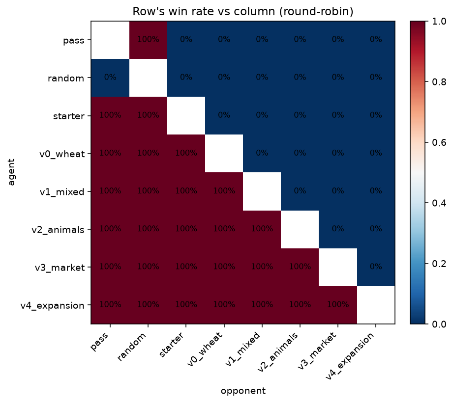

# Baseline Elo ladder

Round-robin over 8 agents (built-ins plus v0-v4), 3 seeds x 2 seat assignments per pair. Ratings are Bradley-Terry MLE re-scaled to the Elo convention (mean 1500, 400 per decade of log-odds).

## Ranking

| Agent | Elo |
|-------|-----|
| `v4_expansion` | 3165 |
| `v3_market` | 2590 |
| `v2_animals` | 2105 |
| `v1_mixed` | 1659 |
| `v0_wheat` | 1234 |
| `starter` | 819 |
| `pass` | 409 |
| `random` | 19 |

## Win-rate matrix

Row's win rate against column, ties excluded from the numerator.

## Notes

- Baseline commits each closed with a two-agent A/B (v_n vs v_{n-1}); this report is the aggregate view.
- Seeds used: 0-2.
- Every episode is reproducible from `(agent_pair, seed, seat_0)` plus the `kaggle-environments` version pinned in `pyproject.toml`.
