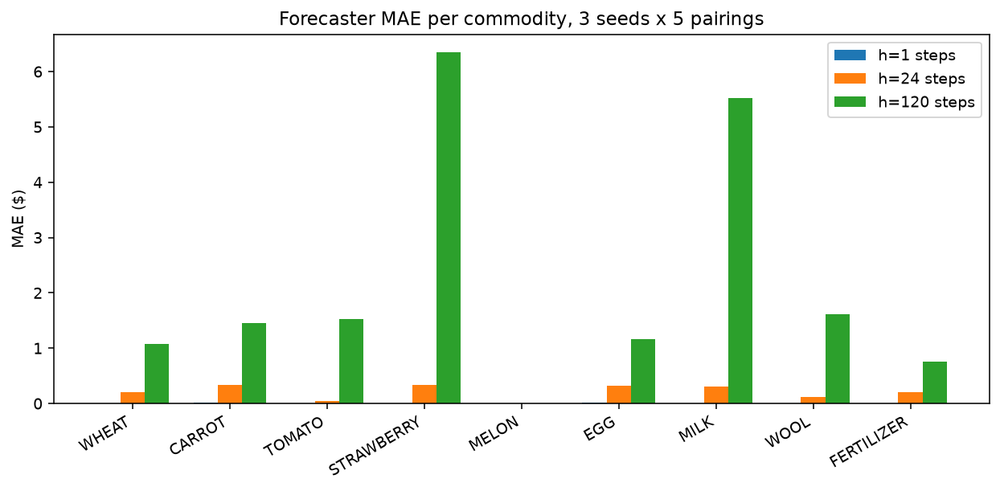

# Market price forecaster model card

## Purpose

Predict the future price of each traded commodity ($n$ steps ahead) from the
public state, and feed the result to the planning stack. Consumers are
`DynamicReplanner` (as its `price_map` input) and the M7 route-plus-trading
agent.

## Inputs

- `Observation.market.inventory[item]`: current market inventory per commodity.
- `Observation.market.prices[item]`: current price per commodity (used by the
  naive baseline; not required by the forecaster itself).
- `Observation.town.unlocked_shops`: shop list active over the horizon, used to
  enumerate deterministic future consumption.
- Running EWMA of net trade rate per commodity, updated online from the market
  inventory delta between consecutive turns after subtracting the deterministic
  town consumption.

## Outputs

- `predict(obs, horizon_steps) -> dict[str, float]`: forecasted price per
  commodity for a horizon expressed in turns. `predict_days(obs, k)` is the
  same with `horizon_steps = k * 24`.
- Runtime is dominated by the `market_price` curve evaluation (nine hashed
  parameter lookups and one arithmetic expression per commodity), well under
  100 microseconds per call on a laptop. Safe inside the 1s per-turn budget.

## Model

$$
\hat{p}_{t+H}(i) = \text{market\_price}\left(i,\; M_t(i) + H \cdot r_t(i) - C_{[t, t+H)}(i)\right)
$$

- $M_t(i)$: current market inventory for commodity $i$.
- $r_t(i)$: EWMA net trade rate, updated per turn with smoothing $\alpha = 0.2$.
- $C_{[t, t+H)}(i)$: deterministic town consumption over the horizon (town
  center every 24 steps for every non-fertilizer product, plus one hit per
  unlocked shop instance every 4 steps).
- `market_price` is the piecewise curve
  $p(x) = \text{base} + \text{sign} \cdot \text{amp} \cdot f(|x - I_0|)$
  transcribed from `kaggriculture.py`, floored at $1.

The EWMA is the only learned component. There is no offline training step; the
forecaster starts every episode with `rate = 0` and warms up over the first few
turns.

## Evaluation protocol

- Pool: five pairings across the built-in agents (`pass`, `random`, `starter`)
  and our v0 through v4 baselines. Each pairing runs on three seeds
  (`{0, 7, 42}`) for a full 720-step episode.
- For every valid `(t, H)` where `t + H` is still in the episode, we compute
  the forecast and compare against the true price at $t + H$. Absolute error
  is averaged over all rows.
- Baseline: constant-price forecast (predict $p_t$ for time $t + H$).
- Horizons reported: 1 step (~immediate), 24 steps (1 day), 120 steps
  (5 days).

Full reproduction is in [notebooks/06-market-forecaster.ipynb](../notebooks/06-market-forecaster.ipynb).

## Results

Aggregate MAE across all pairings and seeds:

| Horizon (steps) | Forecast MAE ($) | Naive MAE ($) | Lift |
|-----------------|-----------------:|--------------:|-----:|
| 1               | 0.05             | 0.78          | 94%  |
| 24              | 1.88             | 17.57         | 89%  |
| 120             | 19.34            | 84.25         | 77%  |

Per-commodity MAE at horizon = 24 steps (1 day):

| Item        | Forecast MAE ($) |
|-------------|-----------------:|
| WHEAT       | 0.2              |
| CARROT      | 0.3              |
| TOMATO      | 0.0              |
| STRAWBERRY  | 0.3              |
| MELON       | 0.0              |
| EGG         | 0.4              |
| MILK        | 0.3              |
| WOOL        | 0.1              |
| FERTILIZER  | 0.2              |

Per-commodity MAE at horizon = 120 steps (5 days):

| Item        | Forecast MAE ($) |
|-------------|-----------------:|
| WHEAT       | 1.1              |
| CARROT      | 1.5              |
| TOMATO      | 1.4              |
| STRAWBERRY  | 6.4              |
| MELON       | 0.0              |
| EGG         | 1.2              |
| MILK        | 5.6              |
| WOOL        | 1.5              |
| FERTILIZER  | 0.8              |

## Calibration

Predicted vs actual price scatter, one dot per `(t, item, pairing, seed)`
combination:

Per-commodity error at each horizon:

The scatter is on the identity line at horizon 1 and fans out sharply for
premium commodities (strawberry, milk) at horizon 120. That is the residual
error the EWMA does not capture: bursty selling that pushes the market past
the curve's knee within a single day.

## Known failure modes

- **Premium glut timing.** STRAWBERRY, MILK and WOOL have `above_target >= 1.6`,
  so their price drops fast under a glut. Smoothed rate averages over past
  turns and cannot anticipate a burst sell in the next 5 days; MAE rises to
  $5-7 for these three at horizon 120.
- **Shop unlocks inside the horizon.** The forecaster assumes the shop list is
  frozen over the horizon. Shops unlock every three days at end-of-day. The
  first-day forecast (24 steps) is exact; the 5-day forecast (120 steps)
  misses at most one shop unlock event, biasing consumption downward by 0-2
  units on the relevant commodity per shop.
- **Cold start.** With `rate = 0` at $t = 0$ the forecaster is equivalent to
  the deterministic (town-only) projection for the first few turns. This is
  fine for horizon 1 but underestimates trade drift for horizon 24 and 120
  in the first day of an episode.
- **Zero-activity commodities.** MELON MAE stays at zero because none of the
  agents in the pool sell melon; its inventory sits at $I_0$ and its price
  stays at $250. A melon-heavy opponent would give a non-trivial number and
  is not represented in this evaluation pool.
- **No opponent inference feedback loop yet.** The opponent inventory tracker
  ([src/kaggriculture/opponent/inference.py](../src/kaggriculture/opponent/inference.py))
  gives us the opponent's per-commodity holdings, which is a direct signal
  for near-future sells. The current forecaster ignores it. Wiring the two
  together is a natural next step for M7.

## Configuration

- `smoothing = 0.2` (EWMA alpha).
- `turns_per_day = 24`, `shop_interval = 4`, `center_interval = 24`.
- `kaggle-environments >= 1.32.7`.
