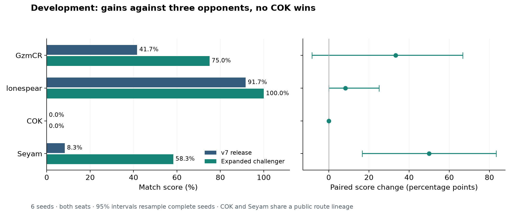

# Second-cycle research results

The second cycle exposes a limitation in the original benchmark: the v7
release loses heavily to two newly qualified public route agents. A combined
liquidity, market-forecast and expansion challenger improves three development
matchups, but still loses every COK development game. It remains a research
candidate while the predeclared matched validation completes. No leaderboard
rating or new release is claimed.

## Identities and experimental boundary

Work starts from `48f576f8d781785b90639d2072fd484acab8fd00`, the unmerged
first-cycle branch. PR #66 is stacked on PR #65; neither is merged.

| Role | Exact executable SHA-256 | Reproduction |
|---|---|---|
| v7 release and rollback | `750f123073865347efd3b9c4b72022ff9923f4130c929ac76c1b0742374b09ee` | `submissions/20260909-v7/main.py` |
| Expanded research challenger | `0098d9e4f77e2420cb4a09abd47e49f5160009cd0818ae37a793bc3e419ffc4b` | `python scripts/build_phase2_challenger.py` |

The incumbent reproduced the previous cash and statuses exactly in eight
representative games. Its old 128-seed holdout is now known development data.
The environment remains `kaggle-environments==1.32.7`; installed interpreter,
configuration and game guides match the current official upstream files.
[Rule and reference audit](phase2-frontier.md) records the hashes and the
limitations of accessible hosted evidence.

Anchor weights remain 50% lonespear and 50% GzmCR. Tina remains a supplementary
independent crop check in the first-cycle record. The frozen challenge weights
are 50% Seyam and 50% COK. These two share a public route lineage and do not
constitute two new independent strategy families. No difficult opponent was
removed. See the [protocol](phase2-protocol.md) and
[reference manifest](challenge-reference-manifest.json).

## What the diagnosis changed

**Working capital, not just nominal ROI.** A reserve of fertilizer can prevent
buying urgently needed feed or hiring workers. The incumbent also rejects an
entire feed purchase when only part is affordable. The challenger permits
partial feed and sells fertilizer reserves when cash is scarce. It corrects
replenishment to target inventory rather than a capped additional order.

**Admission before scheduling.** Exact replay reconstruction attributes 65 of
70 watering deaths in eight diagnostic games to planting on hour 23. A newly
planted crop already has an unwatered day and dies at the immediate daily
refresh. The challenger rejects that planting opportunity. Raising generic
watering priority did not solve the same problem.

**Market exposure and scale interact.** The research challenger forecasts
inventory using current observable assets and expected future shop demand,
blends that forecast with the current quote, and permits 50 crops across three
quadrants with 12 hired workers. Its mixed herd remains four cows, six sheep
and eight geese. Neither expansion nor the forecast alone justified promotion.
The combined version can fund and service more production after the liquidity
repairs. These are capacity limits, not a forced final footprint.

The forecast is an approximate scenario, not an exact economic rollout. It
assumes servicing and delivery, approximates care, and omits later replanting,
new investment and crop decay. Its price curve agrees with the interpreter;
that does not prove that its candidate rankings are correct. The
[independent review](phase2-independent-review.md) found no future-state or
private-opponent leakage and records these modeling limits.

## Development comparison and ablations

The combined challenger was selected using known seeds 0, 5, 11, 17, 42 and
103, both seats. This is exploratory evidence, not an unbiased strength
estimate. [Exact paired summary](results/phase2-paired-summary.json) retains
source hashes, result-file hashes, complete scenarios and paired intervals.

| Opponent | v7 wins / 12 | Challenger wins / 12 |
|---|---:|---:|
| lonespear `774b260` | 11 | 12 |
| GzmCR `6a76335` | 5 | 9 |
| Seyam `8b8c421` | 1 | 7 |
| COK `7ef67ea` | 0 | 0 |



The following interventions used small matched development panels, not the
fresh validation split. Counts refer to the specified experiments; reruns and
copied subsets are deduplicated in the [experiment index](phase2-experiment-index.json).

| Question | Informative result | Decision |
|---|---|---|
| Can transport rules or task bundles recover most losses? | Nightly delivery, delivery exclusion, deadline scoring and compatible-task bundles produced inconsistent anchor changes and no challenge breakthrough. Bundle maintenance improved while travel rose slightly. | Reject these versions; fewer missed tasks alone is insufficient. |
| Does exact marginal animal service improve the policy? | A small finite-horizon model passed 1,980 official animal transitions, but its 16-game policy screen lost ground. Optimistic harvest and terminal assumptions remain. | Reject deployed DP; retain interpreter probes. |
| Do crop-first openings and larger recurring-crop farms beat public routes? | Startup wheat improved cash and herd formation; strawberry cohorts arrived earlier. Land, inputs and labor still consumed returns, and shared berry supply reduced prices. | Reject tested families. |
| Does inventory forecasting alone help? | Forecast-only and corrected-value variants failed their screens; feed affordability and reserve behavior blocked execution. | Test interaction with liquidity rather than promote a better-looking forecast. |
| Which components explain the combined gain? | On seeds 17/103 against both challenge opponents: liquidity plus expansion won 0/8; liquidity plus forecast 2/8; all three 4/8, all against Seyam. | Advance the combined version to broader matched development, then one frozen validation. |
| Can flexible livestock exploit expensive milk? | Adaptive 18 animals narrowed the initial COK mean deficit from 35,825 to 21,459 but won no COK games in the extension. More milk also collapsed prices in other scenarios. | Reject unconditional herd flexibility and 22-animal expansion. |
| Should flexibility wait for actual shop information? | Waiting for two observed shops changed species allocation, but Seyam fell from 4/4 to 1/4 and COK remained 0/4. | Reject this version; higher own cash did not imply higher match score. |
| Is speculative market holding useful? | One- and two-day inventory holding did not improve challenge wins; funded speculative positions did not activate. | Reject added trading complexity. |
| Does investment improve when it charges the price impact on existing own-herd revenue? | A virtual-animal forecast includes pending animals, existing receipts and feed-price effects. After removing runtime fallback activity, it wins 2/4 Seyam and 0/4 COK games, without beating simpler adaptive allocation. | Reject this implementation; the clean follow-up separates the economic result from the first version's budget fallback. |

Two early experimental controller edits were incorrect: a planting guard
fell through to DIG on empty ground, and a nightly-delivery change allowed
DROP away from a shed. Their exact failed artifacts and outcomes remain in
the evidence; later builders correct both and have regression tests. Those
losses cannot be presented solely as evidence against the intended strategy.
An initial market-model guard also disabled its forecast; identical v7 results
from that run are an integration failure, not a forecast ablation.

Detailed causal observations are in the [loss diagnosis](phase2-diagnosis.md)
and [economic study](phase2-economics.md). The record deliberately retains
counterexamples: one adaptive farm earned 117,454 after selling 318 milk and
still lost by 20,648.

Screening and diagnostics remain within the expanded 640-game budget. The
archive contains 624 rows: 584 unique episode records covering 568 physical
scenarios, plus explicitly identified copies and reruns. Validation is counted
separately. The final marginal-investment follow-up records zero stderr and a
105.0 ms maximum decision; its first version's 148 stderr turns are preserved
as evidence of the runtime confound.

## Validation and release decision

The protocol freezes one challenger at revision `9b73672` before opening seeds
2000–2063. It runs both policies against the same four executables, both seats:
1,024 games. The panel is in progress; no partial result selects a variant.
The 128-seed final holdout, 20000–20127, remains unopened.

Promotion requires an anchor improvement of at least five percentage points
with a positive lower 95% paired bound, each anchor family at least 40%, and
a positive challenge improvement with at least 50% challenge score. Errors,
timeouts or failed deployment checks also prevent promotion. No result will
change these weights or thresholds.

Uncertainty resamples 10,000 complete seed blocks, retaining both seats,
both candidate identities and all opponents. This estimates seed variation
within a named pool, not uncertainty about missing opponent families or a
live rating. The official daily RNG consumes weed draws before shop selection;
changed farm occupancy can change realized future shops. A matched seed is
a whole-policy intervention, not a guarantee of identical future demand.

## Reliability and reproduction

The frozen research artifact passed 2,876 source/artifact action comparisons
over four complete games, 60 isolated observation checks, repeated episode
state, and two fresh `python -I -S` processes outside the repository. Peak
isolated RSS was 24,375,296 bytes. [Packaging measurements](results/phase2-challenger-packaging.json)
identify the exact compared bytes. The v7 release remains byte-identical to
the previous cycle. Local timing is not hosted certification.

```bash
uv sync --frozen --extra dev
uv run python scripts/fetch_references.py
uv run python scripts/fetch_challenge_references.py
uv run python scripts/build_phase2_challenger.py
uv run python scripts/phase2_paired_report.py
uv run python scripts/phase2_figures.py --summary reports/results/phase2-paired-summary.json --output reports/figures/phase2-development.png --label "Development: gains against three opponents, no COK wins"
```

Recreate individual screens with their named `scripts/phase2_*.py` drivers.
Content-addressed snapshots preserve exact historical code even when a later
builder fixes an experiment bug. Restore with `scripts/restore_candidate.py`
and the manifest hash. Large replays remain ignored; validation retains replay
seeds 2000 and 2001 for both policies and every opponent.

Kaggle access reports authentication required. No submission was made and no
legal terms were accepted. Once authenticated and eligible, the release command
is `kaggle competitions submit kaggriculture -f submissions/20260909-v7/main.py -m "v7 validated local release"`.
Check current quota and hosted rules first; do not submit the unpromoted research
challenger as a validated improvement. Current rating, game count and live
opponent coverage remain unknown.

The next high-value problem is joint planning of investment and executable
service schedules under opponent supply scenarios. The current forecast can
identify expensive milk yet buy enough cows to erase that opportunity. Charging
the estimated revenue loss on existing animals did not fix the tested policy:
its servicing, delivery and future production assumptions remain approximate.
It also cannot replace a large irreversible early herd after shop demand
changes. More fixed capacity and more parameter trials did not resolve that
limitation.
